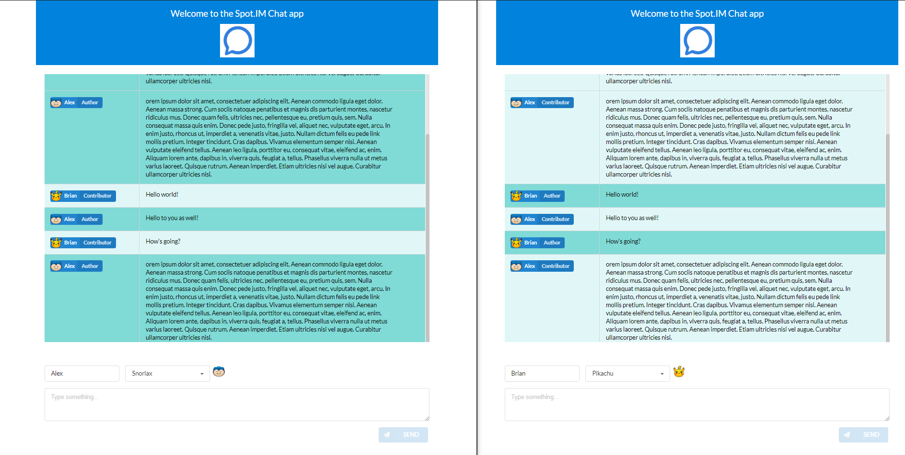
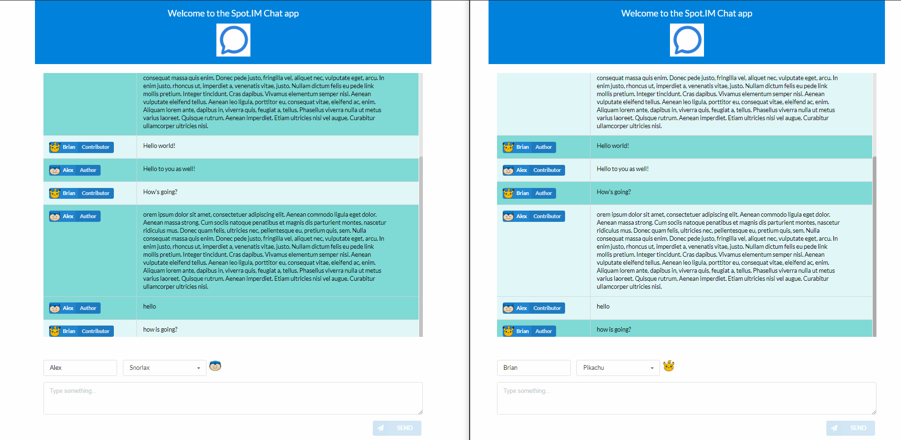

### Chat UI

Basic Chat UI build using [React](https://github.com/facebook/react), [Semantic UI React](https://github.com/Semantic-Org/Semantic-UI-React) and [Socket IO](https://github.com/socketio/socket.io).

## Getting Started

* Navigate to the project root directory
* Run the following commands:

  ```shell
    >> npm install
    >> npm start
  ```

* Navigate to `localhost:3000` in your browser

## ScreenShot


## Gif
